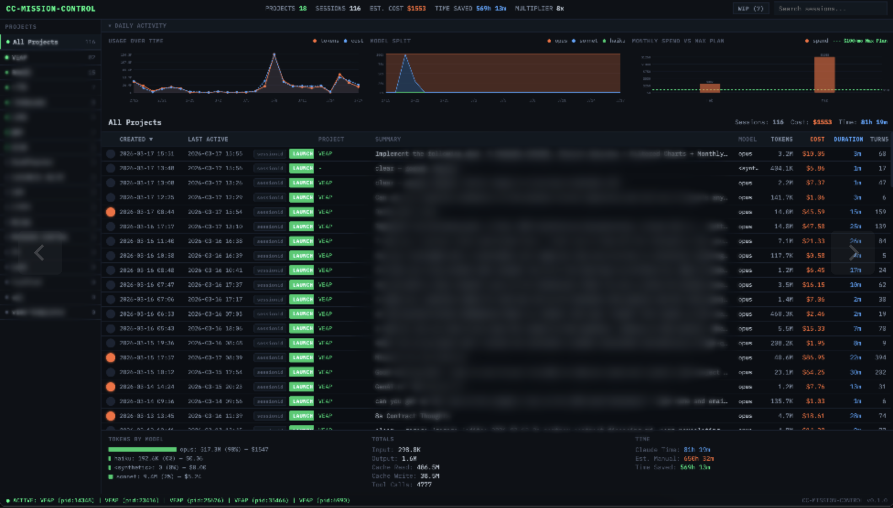

# MISSION-CONTROL

A local dashboard for monitoring Claude Code sessions across all your projects. Tracks costs, token usage, time savings, and lets you resume sessions -- all from a single pane of glass.

Built for anyone using [Claude Code](https://docs.anthropic.com/en/docs/claude-code) who wants visibility into how their AI-assisted development time is being spent.

## What It Does

- **Discovers projects automatically** by scanning a directory for Claude Code projects (anything with a `.claude/` folder)
- **Parses session data** from Claude Code's JSONL files to extract token counts, costs, models used, tools called, and auto-generated summaries
- **Calculates costs** per session using configurable model pricing (Opus, Sonnet, Haiku)
- **Estimates time saved** based on a configurable multiplier (e.g., "this would have taken 8x longer without Claude")
- **Interactive charts** -- daily usage trends, model split over time, monthly spend vs. plan limits
- **Session management** -- mark sessions as WIP/Complete, edit summaries, search across all sessions
- **Resume sessions** -- launch a Claude Code `--resume` directly from the dashboard into your configured terminal

## Screenshot



## Prerequisites

- **Node.js** v24+ (LTS)
- **Claude Code CLI** installed and configured (this reads Claude Code's local data files)
- A supported terminal emulator (optional, for the session resume/launch feature): Ghostty, Alacritty, Kitty, COSMIC Terminal, or Zed

MISSION-CONTROL is read-only against your Claude Code data. It reads `.jsonl` session files and process metadata but never modifies them.

## Setup

```bash
# Clone the repo
git clone https://github.com/YOUR_USERNAME/MISSION-CONTROL.git
cd MISSION-CONTROL

# Install dependencies (just Express and Chokidar)
npm install

# Create your local config
cp config.example.json config.json
```

Edit `config.json` with your paths:

```json
{
  "scanPath": "/Users/you/projects",
  "claudeDir": "/Users/you/.claude",
  "port": 9000
}
```

| Field | What it is |
|-------|-----------|
| `scanPath` | The parent directory containing your Claude Code projects. MISSION-CONTROL scans this recursively for any folder with a `.claude/` subdirectory. |
| `claudeDir` | Path to your `~/.claude` directory where Claude Code stores session data. Usually `~/.claude`. |
| `port` | Server port. Default `9000`. |

Tilde paths (`~/projects`) are expanded automatically.

## Running

```bash
# Development (auto-restarts on file changes)
npm run dev

# Production
npm start
```

Then open [http://localhost:9000](http://localhost:9000).

## How It Works

### Project Discovery

MISSION-CONTROL scans your `scanPath` for directories containing a `.claude/` folder. Each discovered project maps to Claude Code's session storage convention:

```
~/projects/my-app/        ->  ~/.claude/projects/-Users-you-projects-my-app/
```

Session data lives in `.jsonl` files inside those encoded directories. MISSION-CONTROL reads and parses them on the fly, with caching based on file modification time.

### Session Parsing

Each session file is a sequence of JSON lines containing user messages, assistant responses (with token usage), and system events. The parser extracts:

- **Token counts** -- input, output, cache read, cache write (per model)
- **Cost** -- calculated from token counts and configured pricing
- **Summary** -- auto-generated from the first few user messages and tool actions
- **Duration** -- from first to last timestamp
- **Tool usage** -- counts of Edit, Write, Bash, Grep, etc.
- **Turn count** -- number of assistant responses

### Cost Calculation

Pricing is configured per model in `config.json`. The defaults reflect current Claude API pricing:

| Model | Input | Output | Cache Read | Cache Write |
|-------|-------|--------|------------|-------------|
| Opus 4.6 | $15/M | $75/M | $1.50/M | $18.75/M |
| Sonnet 4.6 | $3/M | $15/M | $0.30/M | $3.75/M |
| Haiku 4.5 | $0.80/M | $4/M | $0.08/M | $1/M |

Unknown models fall back to Sonnet pricing.

### Time Saved Estimation

The "time saved" metric uses a configurable multiplier representing how much longer the task would have taken without AI assistance. Built-in presets:

| Preset | Multiplier | Interpretation |
|--------|-----------|----------------|
| Non-Programmer / Executive | 8x | Would have taken 8x longer (or required hiring someone) |
| Junior Developer | 2.5x | Significant speedup on unfamiliar tasks |
| Mid-Level Developer | 1.8x | Moderate acceleration |
| Senior Developer | 1.3x | Incremental time savings |

The multiplier is adjustable from the dashboard's top bar.

### Session Resume

Clicking "Launch" on a session opens your configured terminal and resumes the Claude Code session. Set the `terminal` field in `config.json`:

```json
{
  "terminal": "alacritty"
}
```

| Terminal | Platform | Behavior |
|----------|----------|----------|
| `ghostty` (default) | macOS | AppleScript: opens Ghostty, creates new window, runs resume command |
| `ghostty` | Linux | Spawns with `-e` flag, runs resume command |
| `alacritty` | Any | Spawns with `-e` flag, runs resume command |
| `kitty` | Any | Spawns with positional args, runs resume command |
| `cosmic-term` | Linux | Opens in project directory; resume command available via "Copy Cmd" button |
| `zeditor` | Any | Opens/focuses project in Zed; resume command available via "Copy Cmd" button |

For terminals that don't support executing a command directly (cosmic-term, zeditor), the Launch button transitions to "Copy Cmd" so you can paste `claude --resume <id>` into the terminal yourself.

## Dashboard Features

### Top Bar
Global stats at a glance -- project count, session count, total estimated cost, time saved, and the active multiplier.

### Sidebar
All discovered projects listed with session counts. Green indicators show which projects have active Claude Code sessions running. Click a project to filter, or "All Projects" for the aggregate view.

### Charts Panel (collapsible)
- **Daily Activity** -- Token usage and cost over time (dual-axis line chart)
- **Model Split** -- Percentage breakdown of Opus vs. Sonnet vs. Haiku usage over time
- **Monthly Spend** -- Bar chart of monthly costs with a $100/month reference line

### Session Table
- Sort by any column (date, tokens, cost, duration)
- **Status dots** -- click to cycle through WIP / Complete / unmarked
- **Editable summaries** -- double-click to override the auto-generated summary
- **Search** -- filter sessions by summary text or session ID

### Rollup Panel
Expanded stats for the current view: token breakdown by model, total tool calls, and time metrics (Claude time vs. estimated manual time vs. time saved).

## Configuration

`config.json` is gitignored. Your local config persists across pulls. If no `config.json` exists, the app falls back to `config.example.json` with default values.

### Optional Claude Code Context Files

The `.claude/` directory can contain optional context files (`me.md`, `voice.md`, `team.md`, `links.md`) for personalizing how Claude Code behaves within this project. These are gitignored -- they're for your local setup, not required to run the dashboard.

## API Endpoints

All endpoints return JSON.

| Method | Endpoint | Description |
|--------|----------|-------------|
| `GET` | `/api/projects` | List all discovered projects with aggregate stats |
| `GET` | `/api/projects/:path/sessions` | Sessions for a specific project |
| `GET` | `/api/sessions/all` | All sessions across all projects |
| `GET` | `/api/sessions/:id` | Detailed session metrics |
| `GET` | `/api/search?q=query` | Search sessions by summary or ID |
| `GET` | `/api/stats` | Global aggregate statistics |
| `GET` | `/api/daily-stats` | Daily token/cost breakdown (filterable by project) |
| `GET` | `/api/monthly-stats` | Monthly token/cost breakdown (filterable by project) |
| `GET` | `/api/active` | Currently running Claude Code sessions |
| `GET` | `/api/wip` | Sessions marked as WIP |
| `GET` | `/api/config` | Current configuration |
| `PUT` | `/api/config` | Update configuration |
| `PUT` | `/api/sessions/:id/status` | Set session status (wip/complete/null) |
| `PUT` | `/api/sessions/:id/summary` | Edit session summary |
| `POST` | `/api/restore/:id` | Resume session in configured terminal |

## Tech Stack

- **Server:** Node.js 24 LTS + Express
- **Frontend:** React 19 (via esm.sh CDN, no build step)
- **File watching:** Chokidar
- **Styling:** Custom CSS with IBM Plex Mono
- **Dependencies:** 2 production packages (`express`, `chokidar`)

No build tools, no bundlers, no transpilation pipeline. `npm install` and go.

## License

MIT
